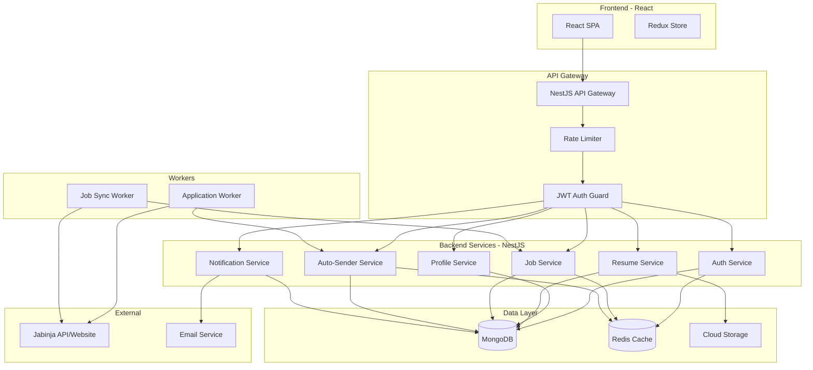

# Design Document: Resume Builder & Auto-Sender

## Overview

This document describes the technical design for a full-stack resume builder application with automatic job application submission to Jabinja. The system follows a microservices architecture using NestJS for the backend API, React for the frontend, MongoDB for data persistence, and Kubernetes for orchestration.

The application enables users to:
1. Create and manage professional profiles with work history, education, and skills
2. Generate PDF resumes from multiple templates
3. Browse and filter job listings from Jabinja
4. Automatically submit applications to multiple jobs in batch
5. Track application status through a dashboard

## Architecture



## Components and Interfaces

### 1. API Gateway (NestJS)

The central entry point for all client requests, handling authentication, rate limiting, and request routing.

```typescript
// Gateway configuration
interface GatewayConfig {
  port: number;
  rateLimitPerMinute: number;
  jwtSecret: string;
  corsOrigins: string[];
}

// Rate limit response
interface RateLimitResponse {
  statusCode: 429;
  retryAfter: number;
  message: string;
}
```

### 2. Auth Service

Handles user registration, authentication, and token management.

```typescript
interface AuthService {
  register(dto: RegisterDto): Promise<AuthTokens>;
  login(dto: LoginDto): Promise<AuthTokens>;
  refreshToken(refreshToken: string): Promise<AuthTokens>;
  requestPasswordReset(email: string): Promise<void>;
  resetPassword(token: string, newPassword: string): Promise<void>;
}

interface RegisterDto {
  email: string;
  password: string;
  firstName: string;
  lastName: string;
}

interface LoginDto {
  email: string;
  password: string;
}

interface AuthTokens {
  accessToken: string;
  refreshToken: string;
  expiresIn: number;
}
```

### 3. Profile Service

Manages user profile data including personal info, work experience, education, and skills.

```typescript
interface ProfileService {
  getProfile(userId: string): Promise<UserProfile>;
  updatePersonalInfo(userId: string, dto: PersonalInfoDto): Promise<UserProfile>;
  addWorkExperience(userId: string, dto: WorkExperienceDto): Promise<UserProfile>;
  updateWorkExperience(userId: string, expId: string, dto: WorkExperienceDto): Promise<UserProfile>;
  deleteWorkExperience(userId: string, expId: string): Promise<UserProfile>;
  addEducation(userId: string, dto: EducationDto): Promise<UserProfile>;
  addSkill(userId: string, dto: SkillDto): Promise<UserProfile>;
  getProfileVersions(userId: string): Promise<ProfileVersion[]>;
}

interface UserProfile {
  id: string;
  userId: string;
  personalInfo: PersonalInfo;
  workExperience: WorkExperience[];
  education: Education[];
  skills: Skill[];
  version: number;
  updatedAt: Date;
}

interface PersonalInfo {
  firstName: string;
  lastName: string;
  email: string;
  phone: string;
  address: Address;
  linkedIn?: string;
  website?: string;
  summary?: string;
}

interface WorkExperience {
  id: string;
  company: string;
  role: string;
  startDate: Date;
  endDate?: Date;
  current: boolean;
  description: string;
  achievements: string[];
}

interface Education {
  id: string;
  institution: string;
  degree: string;
  field: string;
  startDate: Date;
  endDate?: Date;
  gpa?: number;
  achievements: string[];
}

interface Skill {
  id: string;
  name: string;
  category: SkillCategory;
  proficiencyLevel?: ProficiencyLevel;
}

enum SkillCategory {
  TECHNICAL = 'technical',
  SOFT = 'soft',
  LANGUAGE = 'language',
  TOOL = 'tool'
}

enum ProficiencyLevel {
  BEGINNER = 'beginner',
  INTERMEDIATE = 'intermediate',
  ADVANCED = 'advanced',
  EXPERT = 'expert'
}
```

### 4. Resume Service

Generates PDF resumes from user profiles with template support.

```typescript
interface ResumeService {
  generateResume(userId: string, options: ResumeOptions): Promise<GeneratedResume>;
  saveResume(userId: string, resume: GeneratedResume, name: string): Promise<SavedResume>;
  getResumes(userId: string, pagination: PaginationDto): Promise<PaginatedResult<SavedResume>>;
  getResume(userId: string, resumeId: string): Promise<SavedResume>;
  deleteResume(userId: string, resumeId: string): Promise<void>;
  getTemplates(): Promise<ResumeTemplate[]>;
}

interface ResumeOptions {
  templateId: string;
  includeSections: SectionSelection;
  selectedExperiences?: string[];
  selectedEducation?: string[];
  selectedSkills?: string[];
}

interface SectionSelection {
  personalInfo: boolean;
  summary: boolean;
  workExperience: boolean;
  education: boolean;
  skills: boolean;
}

interface GeneratedResume {
  pdfBuffer: Buffer;
  templateUsed: string;
  sectionsIncluded: string[];
  generatedAt: Date;
}

interface SavedResume {
  id: string;
  userId: string;
  name: string;
  templateId: string;
  storageUrl: string;
  sectionsIncluded: string[];
  createdAt: Date;
}

interface ResumeTemplate {
  id: string;
  name: string;
  description: string;
  previewUrl: string;
  style: 'modern' | 'classic' | 'minimal';
}
```

### 5. Resume Generator (PDF Generation)

Core component for transforming profile data into formatted PDF documents.

```typescript
interface ResumeGenerator {
  generate(profile: UserProfile, template: ResumeTemplate, options: ResumeOptions): Promise<Buffer>;
}

interface ResumePrettyPrinter {
  formatToPdf(resumeData: ResumeData): Buffer;
  parseFromPdf(pdfBuffer: Buffer): ResumeData;
}

interface ResumeData {
  personalInfo: PersonalInfo;
  sections: ResumeSection[];
}

interface ResumeSection {
  type: 'summary' | 'experience' | 'education' | 'skills';
  content: any;
}
```

### 6. Job Service

Manages job listings from Jabinja with caching and filtering.

```typescript
interface JobService {
  searchJobs(query: JobSearchQuery): Promise<PaginatedResult<JobListing>>;
  getJob(jobId: string): Promise<JobListing>;
  syncJobs(): Promise<SyncResult>;
}

interface JobSearchQuery {
  keyword?: string;
  location?: string;
  category?: string;
  experienceLevel?: ExperienceLevel;
  page: number;
  limit: number;
}

interface JobListing {
  id: string;
  jabinjaId: string;
  title: string;
  company: string;
  location: string;
  description: string;
  requirements: string[];
  category: string;
  experienceLevel: ExperienceLevel;
  postedAt: Date;
  applicationUrl: string;
}

enum ExperienceLevel {
  ENTRY = 'entry',
  MID = 'mid',
  SENIOR = 'senior',
  LEAD = 'lead'
}
```

### 7. Jabinja Adapter

Integration layer for communicating with Jabinja website/API.

```typescript
interface JabinjaAdapter {
  fetchJobs(params: JabinjaSearchParams): Promise<JabinjaJob[]>;
  submitApplication(jobId: string, application: ApplicationPayload): Promise<SubmissionResult>;
}

interface JabinjaSearchParams {
  query?: string;
  location?: string;
  category?: string;
  page: number;
}

interface ApplicationPayload {
  resumeFile: Buffer;
  coverLetter?: string;
  applicantInfo: ApplicantInfo;
}

interface SubmissionResult {
  success: boolean;
  confirmationId?: string;
  errorMessage?: string;
}

// Retry configuration
interface RetryConfig {
  maxRetries: number;
  baseDelayMs: number;
  maxDelayMs: number;
}
```

### 8. Auto-Sender Service

Manages batch job applications with queue processing.

```typescript
interface AutoSenderService {
  queueApplications(userId: string, dto: BatchApplicationDto): Promise<QueuedApplications>;
  getApplicationStatus(userId: string, applicationId: string): Promise<ApplicationStatus>;
  getApplications(userId: string, filters?: ApplicationFilters): Promise<PaginatedResult<Application>>;
  cancelApplication(userId: string, applicationId: string): Promise<void>;
}

interface BatchApplicationDto {
  resumeId: string;
  jobIds: string[];
  coverLetter?: string;
}

interface QueuedApplications {
  batchId: string;
  applications: QueuedApplication[];
  totalCount: number;
}

interface QueuedApplication {
  id: string;
  jobId: string;
  status: ApplicationStatusEnum;
  queuedAt: Date;
}

interface Application {
  id: string;
  userId: string;
  jobId: string;
  resumeId: string;
  status: ApplicationStatusEnum;
  retryCount: number;
  submittedAt?: Date;
  confirmationId?: string;
  errorMessage?: string;
  createdAt: Date;
  updatedAt: Date;
}

enum ApplicationStatusEnum {
  PENDING = 'pending',
  PROCESSING = 'processing',
  SUBMITTED = 'submitted',
  FAILED = 'failed',
  CANCELLED = 'cancelled'
}

interface ApplicationFilters {
  status?: ApplicationStatusEnum;
  jobId?: string;
  fromDate?: Date;
  toDate?: Date;
}
```

### 9. Application Worker

Background worker that processes the application queue.

```typescript
interface ApplicationWorker {
  processQueue(): Promise<void>;
  processApplication(application: Application): Promise<ProcessResult>;
}

interface ProcessResult {
  success: boolean;
  confirmationId?: string;
  shouldRetry: boolean;
  errorMessage?: string;
}
```

### 10. Notification Service

Handles user notifications across multiple channels.

```typescript
interface NotificationService {
  sendNotification(userId: string, notification: NotificationPayload): Promise<void>;
  getNotifications(userId: string, pagination: PaginationDto): Promise<PaginatedResult<Notification>>;
  markAsRead(userId: string, notificationId: string): Promise<void>;
  updatePreferences(userId: string, preferences: NotificationPreferences): Promise<void>;
}

interface NotificationPayload {
  type: NotificationType;
  title: string;
  message: string;
  data?: Record<string, any>;
  channels: NotificationChannel[];
}

enum NotificationType {
  APPLICATION_SUBMITTED = 'application_submitted',
  APPLICATION_FAILED = 'application_failed',
  BATCH_COMPLETE = 'batch_complete'
}

enum NotificationChannel {
  IN_APP = 'in_app',
  EMAIL = 'email'
}

interface NotificationPreferences {
  emailEnabled: boolean;
  inAppEnabled: boolean;
  applicationUpdates: boolean;
  batchSummaries: boolean;
}
```

### 11. Dashboard Service

Provides application statistics and tracking data.

```typescript
interface DashboardService {
  getApplicationStats(userId: string): Promise<ApplicationStats>;
  getApplicationTimeline(userId: string, days: number): Promise<TimelineData[]>;
}

interface ApplicationStats {
  totalApplications: number;
  submittedCount: number;
  pendingCount: number;
  failedCount: number;
  successRate: number;
}

interface TimelineData {
  date: Date;
  submitted: number;
  failed: number;
}
```

## Data Models

### MongoDB Collections

```typescript
// Users Collection
interface UserDocument {
  _id: ObjectId;
  email: string;
  passwordHash: string;
  firstName: string;
  lastName: string;
  refreshTokenHash?: string;
  createdAt: Date;
  updatedAt: Date;
}

// Profiles Collection
interface ProfileDocument {
  _id: ObjectId;
  userId: ObjectId;
  personalInfo: PersonalInfo;
  workExperience: WorkExperience[];
  education: Education[];
  skills: Skill[];
  version: number;
  createdAt: Date;
  updatedAt: Date;
}

// Profile Versions Collection (for history)
interface ProfileVersionDocument {
  _id: ObjectId;
  profileId: ObjectId;
  version: number;
  snapshot: ProfileDocument;
  createdAt: Date;
}

// Resumes Collection
interface ResumeDocument {
  _id: ObjectId;
  userId: ObjectId;
  name: string;
  templateId: string;
  storageKey: string;
  sectionsIncluded: string[];
  createdAt: Date;
}

// Jobs Collection (cached from Jabinja)
interface JobDocument {
  _id: ObjectId;
  jabinjaId: string;
  title: string;
  company: string;
  location: string;
  description: string;
  requirements: string[];
  category: string;
  experienceLevel: string;
  applicationUrl: string;
  postedAt: Date;
  syncedAt: Date;
}

// Applications Collection
interface ApplicationDocument {
  _id: ObjectId;
  userId: ObjectId;
  jobId: ObjectId;
  resumeId: ObjectId;
  batchId: string;
  status: string;
  retryCount: number;
  submittedAt?: Date;
  confirmationId?: string;
  errorMessage?: string;
  createdAt: Date;
  updatedAt: Date;
}

// Notifications Collection
interface NotificationDocument {
  _id: ObjectId;
  userId: ObjectId;
  type: string;
  title: string;
  message: string;
  data?: Record<string, any>;
  read: boolean;
  createdAt: Date;
}

// Notification Preferences Collection
interface NotificationPreferencesDocument {
  _id: ObjectId;
  userId: ObjectId;
  emailEnabled: boolean;
  inAppEnabled: boolean;
  applicationUpdates: boolean;
  batchSummaries: boolean;
}
```

### Redis Cache Structure

```
# JWT Blacklist (for logout)
jwt:blacklist:{tokenId} -> "1" (TTL: token expiry)

# Rate Limiting
ratelimit:{userId}:{minute} -> count (TTL: 60s)

# Job Cache
jobs:search:{queryHash} -> JSON (TTL: 5min)
jobs:detail:{jobId} -> JSON (TTL: 1hour)

# Application Queue
queue:applications -> List of application IDs
queue:processing:{applicationId} -> "1" (TTL: 5min, lock)
```

## Correctness Properties

*A property is a characteristic or behavior that should hold true across all valid executions of a system—essentially, a formal statement about what the system should do. Properties serve as the bridge between human-readable specifications and machine-verifiable correctness guarantees.*

### Property 1: Profile Data Round-Trip Persistence

*For any* valid user profile data (personal info, work experience, education, skills), saving the data and then retrieving it should return an equivalent profile object with all fields preserved.

**Validates: Requirements 2.1, 2.2, 2.3, 2.4**

### Property 2: Resume Generation Round-Trip

*For any* valid UserProfile object and selected sections, generating a PDF resume and then parsing it should preserve all included information (text content, structure).

**Validates: Requirements 3.6**

### Property 3: Job Filtering Correctness

*For any* set of job listings and filter criteria (location, category, experience level), the filtered results should only contain jobs that match ALL specified criteria.

**Validates: Requirements 5.3**

### Property 4: Application Queue Sequential Processing

*For any* batch of queued applications, the Application_Queue should process them in FIFO order, with no concurrent processing of applications from the same user.

**Validates: Requirements 6.6**

### Property 5: Application Statistics Calculation

*For any* set of user applications, the calculated statistics (total, submitted, pending, failed, success rate) should accurately reflect the actual application statuses in the database.

**Validates: Requirements 7.3**

### Property 6: Rate Limiting Enforcement

*For any* user making API requests, if the request count exceeds 100 within a minute window, subsequent requests should receive 429 status with valid retry-after header.

**Validates: Requirements 9.1, 9.3**

### Property 7: Input Validation and Sanitization

*For any* incoming API request with potentially malicious input (SQL injection, XSS, command injection patterns), the API_Gateway should sanitize the input and reject invalid requests.

**Validates: Requirements 9.2, 9.4**

### Property 8: Retry Behavior with Exponential Backoff

*For any* failed external request (Jabinja API or application submission), the retry mechanism should attempt up to the configured maximum retries with exponentially increasing delays.

**Validates: Requirements 5.4, 6.4**

### Property 9: JWT Token Validation

*For any* protected API endpoint, requests without valid JWT tokens or with expired/blacklisted tokens should be rejected with 401 status.

**Validates: Requirements 9.5**

### Property 10: Notification Preference Respect

*For any* user with configured notification preferences, the Notification_Service should only send notifications through enabled channels and for enabled notification types.

**Validates: Requirements 8.4**

### Property 11: Resume Deletion Completeness

*For any* deleted resume, subsequent retrieval attempts should return not-found, and the associated storage file should be removed.

**Validates: Requirements 4.3**

### Property 12: Application Status Tracking

*For any* application in the queue, its status should accurately reflect its current state (pending, processing, submitted, failed) and status transitions should be valid (no skipping states).

**Validates: Requirements 6.3**

## Error Handling

### Error Categories

1. **Validation Errors (400)**: Invalid input data, missing required fields
2. **Authentication Errors (401)**: Invalid/expired tokens, invalid credentials
3. **Authorization Errors (403)**: Insufficient permissions
4. **Not Found Errors (404)**: Resource doesn't exist
5. **Rate Limit Errors (429)**: Too many requests
6. **External Service Errors (502/503)**: Jabinja unavailable, email service down
7. **Internal Errors (500)**: Unexpected server errors

### Error Response Format

```typescript
interface ErrorResponse {
  statusCode: number;
  error: string;
  message: string;
  details?: ValidationError[];
  timestamp: string;
  path: string;
}

interface ValidationError {
  field: string;
  message: string;
  value?: any;
}
```

### Retry Strategy

For external service failures (Jabinja, email):
- Max retries: 3
- Base delay: 1000ms
- Max delay: 30000ms
- Backoff multiplier: 2
- Jitter: ±10%

### Circuit Breaker

For Jabinja integration:
- Failure threshold: 5 failures in 60 seconds
- Open state duration: 30 seconds
- Half-open: Allow 1 request to test recovery

## Testing Strategy

### Unit Tests

Unit tests verify specific examples and edge cases:

1. **Auth Service**: Token generation, password hashing, validation
2. **Profile Service**: CRUD operations, version history
3. **Resume Generator**: Template application, PDF structure
4. **Job Service**: Filtering logic, cache behavior
5. **Auto-Sender**: Queue management, status transitions
6. **Notification Service**: Channel routing, preference filtering

### Property-Based Tests

Property-based tests verify universal properties across all inputs using **fast-check** library for TypeScript:

| Property | Test Description | Min Iterations |
|----------|------------------|----------------|
| Property 1 | Profile data persistence round-trip | 100 |
| Property 2 | Resume generation round-trip | 100 |
| Property 3 | Job filtering correctness | 100 |
| Property 4 | Queue sequential processing | 100 |
| Property 5 | Statistics calculation accuracy | 100 |
| Property 6 | Rate limiting enforcement | 100 |
| Property 7 | Input sanitization | 100 |
| Property 8 | Retry exponential backoff | 100 |
| Property 9 | JWT validation | 100 |
| Property 10 | Notification preferences | 100 |
| Property 11 | Resume deletion completeness | 100 |
| Property 12 | Application status tracking | 100 |

### Integration Tests

1. **API Gateway**: End-to-end request flow, auth middleware
2. **Jabinja Adapter**: Real API interaction (with mocked responses)
3. **Application Worker**: Queue processing with database
4. **Notification Flow**: Application → Notification creation

### Test Configuration

```typescript
// Jest configuration for property tests
{
  testTimeout: 30000, // Allow time for 100+ iterations
  setupFilesAfterEnv: ['./test/setup.ts']
}

// fast-check configuration
fc.configureGlobal({
  numRuns: 100,
  verbose: true
});
```

### Test Tagging Format

Each property test must be tagged with:
```typescript
/**
 * Feature: resume-builder-auto-sender
 * Property 1: Profile Data Round-Trip Persistence
 * Validates: Requirements 2.1, 2.2, 2.3, 2.4
 */
```
